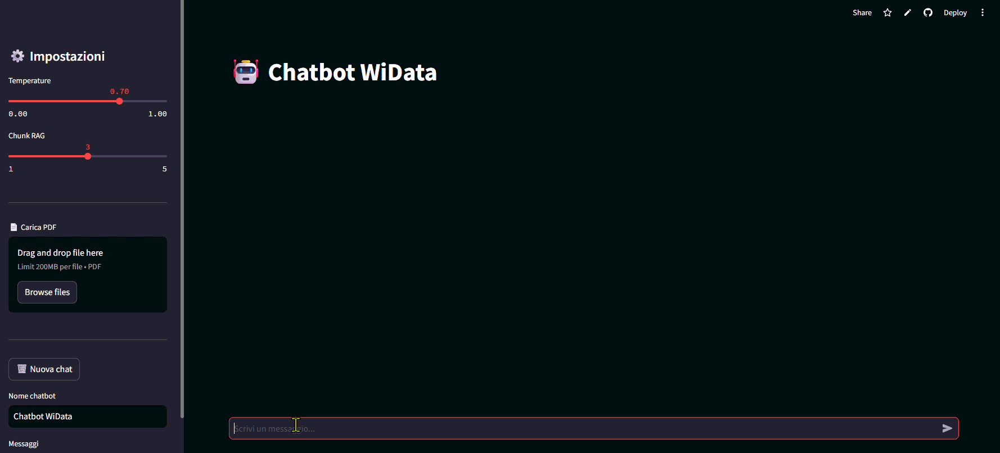

# 🤖 Chatbot WiData

<!-- Badge dello stack tecnologico -->


## 📋 Descrizione

Chatbot RAG (Retrieval-Augmented Generation) sviluppato per WiData Srl, startup IoT e smart cities di Sassari.
L'app permette di caricare un documento PDF aziendale, indicizzarlo automaticamente in chunk e interrogarlo in linguaggio naturale tramite Claude Haiku di Anthropic.
Il chatbot risponde **solo** basandosi sui contenuti del documento caricato, senza inventare dati tecnici, prezzi o specifiche.

## 🚀 Demo

**Live**: [chatbotwidata.streamlit.app](https://chatbotwidata.streamlit.app/)

## 🎥 GIF dimostrativa



## ✨ Funzionalità

- 📄 **Upload PDF**: carica qualsiasi documento aziendale direttamente dalla sidebar
- 🔍 **RAG automatico**: il testo viene suddiviso in chunk e indicizzato in un database vettoriale
- 💬 **Chat multi-turn**: conversazione con memoria della cronologia dei messaggi
- 🎛 **Parametri configurabili**: temperature e numero di chunk RAG regolabili dalla sidebar
- 🛡 **Guardrail di input**: blocca messaggi troppo lunghi o tentativi di prompt injection
- 🔑 **Gestione API key**: compatibile sia con ambiente locale che con Streamlit Cloud
- 📊 **Contatore messaggi**: visualizzazione del numero di messaggi nella sessione corrente

## 🛠 Stack tecnologico

| Tecnologia | Uso |
|------------|-----|
| **Claude Haiku** | Modello LLM di Anthropic usato per generare le risposte in streaming |
| **ChromaDB** | Database vettoriale in-memory per la ricerca semantica sui chunk del PDF |
| **Streamlit** | Framework per l'interfaccia web interattiva e la gestione della sessione utente |
| **pypdf** | Estrazione del testo grezzo dalle pagine del PDF caricato |
| **Python 3.12** | Linguaggio base del progetto |

## 📐 Architettura

Il flusso RAG si articola in quattro fasi principali:

1. **Indicizzazione**: il PDF caricato viene letto con `pypdf`, il testo estratto viene suddiviso in chunk da 400 caratteri con overlap di 50, e ogni chunk viene salvato in una collection ChromaDB.
2. **Retrieval**: alla ricezione di un messaggio utente, ChromaDB cerca i chunk semanticamente più rilevanti tramite query testuale.
3. **Augmentation**: i chunk recuperati vengono iniettati nel prompt come contesto, insieme alla domanda originale dell'utente.
4. **Generation**: Claude Haiku riceve il contesto arricchito e genera una risposta in streaming, visibile in tempo reale nell'interfaccia.

```
PDF → chunking → ChromaDB
                    ↓
Domanda utente → retrieval → prompt arricchito → Claude Haiku → risposta
```

## ⚙️ Esecuzione in locale

```bash
# Clone
git clone https://github.com/ectorr01/Streamlit_chatbot_test
cd Streamlit_chatbot_test

# Installa dipendenze
pip install -r requirements.txt

# Configura API key
mkdir .streamlit
echo 'ANTHROPIC_API_KEY = "sk-ant-..."' > .streamlit/secrets.toml

# Avvia
streamlit run app.py
```

## 📍 Posizionamento Crawl-Walk-Run

Il chatbot si posiziona in zona **WALK** perché supera la semplice risposta generica (CRAWL) e introduce un meccanismo di recupero contestuale reale tramite RAG: il modello non inventa, ma risponde basandosi esclusivamente sui documenti aziendali caricati.
L'app è già deployabile, configurabile e dotata di guardrail di sicurezza, ma non raggiunge ancora il livello RUN perché manca di persistenza dei dati, autenticazione utente, integrazione con sistemi esterni e ottimizzazione degli embedding.

```
CRAWL 🐛          WALK 🚶 ← siamo qui          RUN 🏃
─────────────────────────────────────────────────────
Chatbot generico  RAG su PDF + guardrail       Embedding ottimizzati
Solo LLM base     Streaming + session state    Persistenza + auth
Nessun contesto   Deploy su Cloud              Integrazione sistemi
```

## 🔮 Passo successivo

Per avanzare verso **RUN** implementeremmo:

- 🧠 **Embedding reali**: sostituire la ricerca testuale di ChromaDB con embedding vettoriali veri (es. `sentence-transformers`) per una retrieval semantica più precisa
- 💾 **Persistenza**: salvare le collection ChromaDB su disco o su database cloud per non perdere l'indicizzazione al riavvio dell'app
- 🔐 **Autenticazione**: aggiungere un sistema di login per limitare l'accesso all'app solo agli utenti autorizzati di WiData
- 📂 **Multi-documento**: supportare più PDF contemporaneamente, con selezione del documento da interrogare
- 📊 **Logging e analytics**: tracciare le domande più frequenti per migliorare la knowledge base aziendale

***


## 🚢 Guida al Deploy su Streamlit Cloud

### Prerequisiti

Prima di iniziare, assicurati di avere:

- [ ] Account GitHub con repository pubblica
- [ ] `app.py` nella root o in una sottocartella del repo
- [ ] `requirements.txt` nella root del repository
- [ ] Account su [share.streamlit.io](https://share.streamlit.io) (gratuito)

***

### Passo 1 — Push su GitHub

Aggiungi i file necessari e fai il push:

```bash
git add app.py requirements.txt .gitignore README.md
git commit -m "Deploy chatbot WiData"
git push
```

> ⚠️ Assicurati che `.streamlit/secrets.toml` sia nel `.gitignore` e **non** venga pushato.

***

### Passo 2 — Crea una nuova app su Streamlit Cloud

1. Vai su [share.streamlit.io](https://share.streamlit.io)
2. Clicca **New app**
3. Compila i campi:

| Campo | Valore |
|-------|--------|
| Repository | `tuo-username/tuo-repo` |
| Branch | `main` |
| Main file path | `tuo-percorso/app.py` |

***

### Passo 3 — Aggiungi il Secret ⚠️

> **Fallo PRIMA di cliccare Deploy**, altrimenti l'app si avvia senza la chiave e va in errore.

1. Clicca su **Advanced settings**
2. Vai nella sezione **Secrets**
3. Inserisci:

```toml
ANTHROPIC_API_KEY = "sk-ant-..."
```

***

### Passo 4 — Deploy

Clicca **Deploy** e attendi **3–5 minuti** per la prima build (il tempo dipende dal peso delle dipendenze).

***

### Passo 5 — URL pubblico

Una volta completato il deploy, l'app sarà disponibile all'indirizzo:

```
https://TUONOME-chatbot-widata-HASH.streamlit.app
```

***

### ❌ Errori comuni

| Errore | Causa | Soluzione |
|--------|-------|-----------|
| `ModuleNotFoundError` | `requirements.txt` incompleto | Aggiungi il modulo mancante e rifai il push |
| `AuthenticationError` | Secret non configurato o errato | Vai in Settings → Secrets e verifica la chiave |
| `File non trovato` | Path sbagliato nel campo *Main file path* | Controlla il percorso esatto di `app.py` nel repo |
| Build molto lenta | Dipendenze pesanti (es. `sentence-transformers` ~800MB) | Normale al primo deploy, attendi |


***

## 📊 Presentazione

[]((https://docs.google.com/presentation/d/1oVxLFj8gFNGX6vmVCsImxrVfQziAv69cd_wzTyX6nKY/edit?usp=drive_link))


---
*Progetto realizzato durante il corso AI Engineering Fundamentals*
*ITS Novitas 4.0 — Sassari, 2026*
